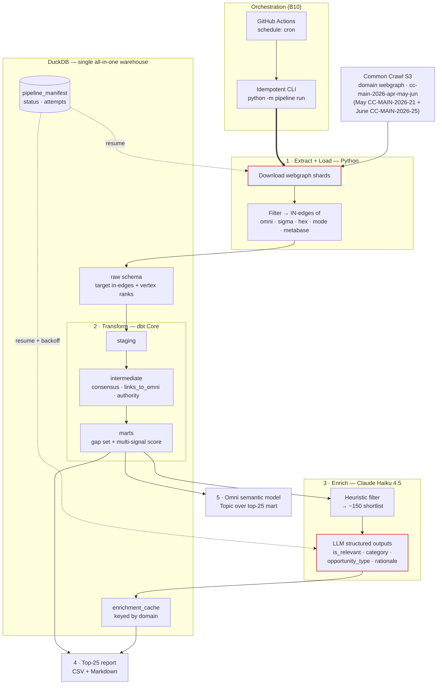

# Omni Growth Engineering Take-Home — Tech Spec

> **Status: COMPLETE.** All 7 build steps shipped. Map: §2 locked scope decisions · §6 reproducibility/retry/scheduling · §7 implicit & explicit contracts · §8 Omni model · §9 build log (with the LLM iteration story) · §12 delivery statement (implemented / out of scope / hours vs. week). This document is Deliverable #5.

---

## 1. The question & framing

**Deliverable question:** _"Which high-value backlink opportunities should Omni investigate based on competitor backlink patterns?"_ → output **≤25 referring domains**, useful to a Growth Marketing team, **not merely a ranking of large numbers**.

**What this actually is:** a **backlink gap analysis** over Common Crawl's link graph — find referring _domains_ that link to Omni's competitors but **not** to Omni, rank by value, hand Growth a short actionable list.

**Clarifications resolved:**
- **Backlink** = inbound hyperlink; **referring domain** = unique linking domain (the deliverable unit; brief caps at 25).
- **"Backlink position"** = competitive standing (who links to us vs. competitors) → the gap is the opportunity.
- **"Semantic layer"** here = BI/analytics business-metric layer (Omni modeling) 
- **"Retry semantics"** = idempotency + resumability + checkpointing for a recurring scheduled pipeline. Mirror the team's "claim-a-row" pattern at MVP scale (our own lightweight manifest — NOT their Snowflake/AWS/Dagster).

---

## 2. Locked scope decisions (all batches)

| # | Area | **Decision** | Rationale (1-line) | Rejected |
|---|---|---|---|---|
| B1 | Language | **Python** | Native fit: DuckDB, dbt Core, Parquet, CC tooling | TypeScript |
| B2 | Data source | **CC domain webgraph**, single release `cc-main-2026-apr-may-jun` | Pre-aggregated domain→domain edges + built-in ranks; laptop-feasible; already the right shape | Raw WAT parsing (heavy, sampling-biased); WAT hybrid (stretch) |
| B3 | Competitor set | Omni + Sigma + Hex + **Mode + Metabase** | All-modern/embedded-BI peer set → topically-relevant, cleaner referrers | Looker+Tableau (incumbents, noisier); mixed |
| B4 | "High-value" ranking | **Multi-signal score**: competitor-consensus × authority × gap, after filtering | Directly answers "useful, not just big numbers" | Consensus-only; authority-only (big-numbers trap) |
| B5 | Two-crawl handling ("both") | **Single `cc-main-2026-apr-may-jun` release**, which aggregates May (`CC-MAIN-2026-21`) + June (`CC-MAIN-2026-25`) as inputs. Cite both crawl IDs in write-up. | Both named collections are literal inputs to one graph → honors "use both" literally, keeps feasible path. Verified vs. CC release index. | Union of 2 snapshots; one-now-both-wired; per-month trend (all moot/week-1) |
| B6 | Ingest / scale | **Filter edges to target in-edges on ingest** (dst ∈ 5 targets) | Billions of edges → thousands; laptop-trivial, still complete for gap analysis | Full-load-then-filter |
| B7 | Authority signal | **CC's published domain ranks** (harmonic centrality + PageRank), joined in | Free, standard, defensible, zero extra compute | Compute own PageRank (meaningless on filtered subgraph); external Ahrefs/Moz (no API) |
| B8 | Filtering + enrichment | **Heuristics + bounded cached LLM (Haiku 4.5) hybrid** | Deterministic cleanup → ~150 shortlist, then Haiku pass for relevance-filter + category + opportunity-type + rationale. Best "Growth-useful"; mirrors team's LLM-enrichment→raw-outputs→dbt pattern | Heuristics-only (defensible lean MVP; now the week-1 fallback); Sonnet 5 (overkill); minimal |
| B9 | Retry-semantics depth *(B3)* | **Real minimal manifest + demonstrable resume**, scoped to the 2 flaky seams (S3 download, LLM calls); backoff only on LLM | Named grading criterion; ~30 lines in DuckDB; kill-and-resume actually works | Overwrite-only (no partial resume); full dead-letter/backoff/circuit-breaker (over-built; ≈ team's platform) |
| B10 | Scheduling / orchestration *(B3)* | **Idempotent CLI entrypoint** (`python -m pipeline run --release …`) **+ committed GH Actions `schedule:` cron / Makefile** | Schedule just re-calls the idempotent entrypoint; ties to B9; real, free, no infra | Real orchestrator (Dagster/Airflow — overkill; rebuilds team's stack); prose-only |
| B11 | dbt project structure *(B3)* | **Standard 3-layer + targeted tests + 1 contract on top-25 mart + singular "no gap domain links to omni" test.** ⚠️ Known depth-gap — revisit hands-on at build | Idiomatic; the singular test asserts the analysis _thesis_; hits brief's "contracts" ask | Minimal (underwhelms named deliverable); elaborate (padding) |
| B12 | Omni semantic model *(B3)* | **One faithful Omni Topic over the top-25 mart** — dimensions + measures + score metric; ground syntax in Omni docs at build | Fidelity to their real format = strongest signal (their product); one wide mart = degenerate star | Elaborate multi-model (more chances to get their format wrong); generic MetricFlow/LookML YAML (reads as "didn't learn Omni") |
| B13 | Report format *(B4)* | **CSV (data) + Markdown report** w/ per-domain `score · category · opportunity_type · why · suggested action` | Two audiences (pipeline vs human); hits "actionable, not big-numbers" bar | Notebook (reads as scratchpad); Omni dashboard mock (can't truly render) |
| B14 | Packaging *(B4)* | **Makefile + pinned lockfile; NO Docker** (documented as trivial optional add) | Pure Python+DuckDB → no system deps; `make setup && make run` is the expected UX; Docker ROI ≈ nil here | Docker primary (heavier, needs daemon + volume mounts for marginal gain); both |
| B15 | Warehouse target *(B4)* | **Local `.duckdb` default; MotherDuck = one-line documented swap** | Reproducible with zero accounts; prod / "Omni-connects-here" story as a `profiles.yml` switch | MotherDuck-first (needs account/token to grade); local-only (drops prod story) |
| B16 | Intermediate storage *(B4)* | **All-in-DuckDB** — raw loaded into a `raw` schema; downloaded CC files on disk = true landing zone. Parquet/S3 landing = described prod evolution | Simpler + more idiomatic dbt (transform tables already in warehouse); one artifact; fewer wiring snags while learning dbt | Parquet landing (marginal signal, extra `source` file-path wiring — not worth a few-hours build) |

**Model IDs:** enrichment = `claude-haiku-4-5`. Sonnet alt = `claude-sonnet-5`.
_(B9–B12 = Batch 3 engineering-rigor; B13–B16 = Batch 4 packaging.)_

---

## 3. Verified facts (from CC live sources)

- **May 2026 crawl** = `CC-MAIN-2026-21` (May 8–21, 2026)
- **June 2026 crawl** = `CC-MAIN-2026-25` (Jun 5–18, 2026)
- **Domain webgraph release** `cc-main-2026-apr-may-jun` built from **Apr + May + June 2026** crawls → **includes both named crawls**.
- Webgraph cadence: **rolling ~monthly**, each a 3-month window (corrects an earlier wrong "3×/year + lag" assumption — no lag; latest already includes June).
- **✅ VERIFIED (2026-07-22, HTTP HEAD):** all three files live under `https://data.commoncrawl.org/projects/hyperlinkgraph/cc-main-2026-apr-may-jun/domain/` — `…domain-vertices.txt.gz` **0.9 GB**, `…domain-edges.txt.gz` **14.6 GB**, `…domain-ranks.txt.gz` **2.4 GB** (~17.9 GB total gz; last-modified 2026-06-24). `Accept-Ranges: bytes` → chunked resumable downloads work, which is what the manifest download units key on.

---

## 4. Pipeline sketch (clean-room, recommended stack)

```
Extract: pull cc-main-2026-apr-may-jun domain webgraph (vertices=ranks, edges) from CC S3
  → filter edges to IN-edges of {omni, sigma, hex, mode, metabase} on ingest → load raw into DuckDB (raw schema)

Transform (dbt Core on DuckDB):
  staging      → clean/standardize vertices + target in-edges
  intermediate → resolve linking domains; join CC ranks; compute per-domain signals
                 (consensus = # of the 5 competitors it links to; links_to_omni bool; authority rank)
  marts        → gap set (links to >=1 competitor, NOT omni) + multi-signal score

Enrich (bounded, cached): deterministic heuristic filter -> ~150 shortlist
  → Haiku 4.5 (structured outputs) -> {is_relevant, category, opportunity_type, rationale}
  → cache to DuckDB table keyed by domain → exported to COMMITTED artifacts/enrichment_cache.csv
    (idempotent; keyless re-runs bootstrap from the committed cache — explicit DRY RUN without API key)

Publish: top-25 report (domain + score + category + opportunity_type + why) + Omni semantic model
```

**High-level architecture:**



_Numbered stages = runtime data flow. Red nodes = the two flaky external seams; dotted edges = `pipeline_manifest` resume/backoff (B9). Everything inside DuckDB is deterministic/idempotent._

---

## 5. Scoring methodology (multi-signal)

- **Gap** (hard filter): domain links to ≥1 of {sigma, hex, mode, metabase} **AND does not link to omni.co**.
- **Consensus**: count of those 4 competitors the domain links to (more = more clearly relevant/reachable).
- **Authority**: CC harmonic centrality / PageRank of the linking domain.
- **Relevance** (LLM): `is_relevant` filter + `category` → drop noise (aggregators/listicles/off-topic).
- **Rank** = weighted blend of consensus × authority, gated by relevance; final = top 25 + actionability tags.
- **Heuristic pre-filters** (free, deterministic): junk TLDs; mega-platforms (facebook/youtube/wikipedia/…); self + competitor domains; rank floor.

---

## 6. Reproducibility, retry & scheduling (LOCKED — B9/B10)

**Two flaky external seams** (everything between is deterministic dbt SQL, idempotent by construction):
1. **S3 webgraph download** — large, possibly sharded files that can fail partway.
2. **~150 LLM enrichment calls** — transient 5xx / rate limits.

**Retry / recovery design (B9 — real minimal manifest + demonstrable resume):**
- `pipeline_manifest` table in DuckDB keyed by `(release, stage, unit)` → `status / attempts / updated_at`. Extract **claims-a-row** per shard before working, marks `done` after; re-runs skip `done` units.
- LLM enrichment **cache-by-domain** table doubles as its checkpoint (a domain already classified is never re-called).
- **Backoff-with-retry only on the LLM calls** (the one seam that genuinely rate-limits); extract simply retries the failed shard.
- Kill the run mid-flight → re-invoke → it resumes. This is the demonstrable "recovery semantics" the brief grades.

**Scheduling (B10 — idempotent entrypoint + committed cron stub):**
- Single entrypoint `python -m pipeline run --release cc-main-2026-apr-may-jun`, safe to re-run.
- Committed **GitHub Actions `schedule:` cron** (or Makefile target) re-invokes it on cadence. A failed run is just re-run; the manifest skips completed work. No orchestrator, no infra.
- Target = local `.duckdb` (dev) or **MotherDuck** (shared/scheduled prod).

**LLM reproducibility:** structured outputs (`json_schema`) for shape; `temperature=0` (works on Haiku 4.5 — NOTE: Sonnet 5 rejects non-default sampling → would rely on caching only); cache-to-table so re-runs don't re-call; Batch API (50% off) optional since scheduled/non-latency-sensitive.

**Cost:** ~$0.10–0.50/run Haiku (vs ~$0.35–1.50 Sonnet) at ~150–300 shortlist calls; effectively one-time due to caching. Non-issue.

**Keyless review & DRY RUN (design added at build):** the enrichment cache doubles as the reproducibility snapshot. After a live run it is exported — sorted by domain, with `model` + `enriched_at` provenance columns — to **committed** `artifacts/enrichment_cache.csv`. Running `enrich` without `ANTHROPIC_API_KEY` prints an explicit, loud **DRY RUN** banner, makes zero API calls, and bootstraps the cache table from the committed CSV — so the full pipeline reproduces end-to-end with **no credentials at all**. Review tiers: (1) read the committed report artifacts; (2) keyless full re-run from the committed cache; (3) regenerate classifications with your own key (`temperature=0` + pinned model + `json_schema` ⇒ near-deterministic). LLM outputs are treated as **data with provenance** — versioned, diffable in git — mirroring the team's "LLM enrichment → raw outputs → dbt" pattern.

---

## 7. Contracts — implicit & explicit

Every stage boundary is either **explicit** (machine-enforced; violation fails the run) or **implicit** (assumed; monitored so drift fails loudly rather than silently).

**Explicit contracts (enforced):**

| Boundary | Contract | Enforced by |
|---|---|---|
| extract → warehouse | `raw.*` table shapes (targets / vertices / ranks / target_edges) | typed `read_csv(columns=…)` loads (fail on drift) + dbt source & staging tests (`unique` / `not_null`) |
| dbt marts → consumers | `top_backlink_opportunities`: 12 columns, exact names + types | dbt **model contract** (`enforced: true`) — build fails on drift |
| analysis semantics | no gap domain links to Omni (thesis) · score ∈ [0,1] · ≤ 25 rows · consensus ∈ {1..4} | singular tests + generic tests, run on every `dbt build` |
| enrich ↔ LLM | response shape `{is_relevant: bool, category: enum(9), opportunity_type: enum(7), rationale: str}` | **structured outputs `json_schema`** (API-side enforcement) + `temperature=0` + pinned `claude-haiku-4-5` |
| enrich → warehouse | `enrich.domain_enrichment` PK(domain) + provenance (`model`, `enriched_at`) | DDL at init; `INSERT OR REPLACE` upsert |
| recovery | unit lifecycle `pending → in_progress → done/failed`; `done` is never redone | `pipeline_manifest` PK(release, stage, unit) + claim/skip helpers (unit-tested) |
| scheduling | every CLI command idempotent + resumable; non-zero exit on failure | stage design + subprocess exit-code propagation |
| repo artifacts | `artifacts/enrichment_cache.csv` column order = cache DDL; sorted by domain (stable git diffs) | export query |
| human review | `enrichment_overrides` seed beats the LLM verdict (`coalesce(override, llm)`); rows only after manual verification; `reason` mandatory | dbt seed + `unique`/`not_null` tests; applied in the top mart |

**Implicit contracts (assumed + monitored):**

| Assumption | Why acceptable | How drift surfaces |
|---|---|---|
| CC file layout & formats (3 tab-separated gz files at the documented URL pattern; reversed-domain notation; edges reference vertices line-ids) | external publisher contract, stable across releases | HEAD-verified pre-build; typed load fails loudly; target-coverage check aborts if omni.co missing |
| ranks cover (nearly) all vertices | CC builds both from the same graph | LEFT JOIN + explicit NULL handling at the rank floor; staging tests |
| registered-domain grain (subdomains pre-aggregated) | the webgraph's documented unit; matches the "referring domain" deliverable | n/a — definitional |
| domain name + world knowledge suffice for classification (no page fetch) | MVP scope; errors bounded by the is_relevant gate + human review of 25 rows | spot-check; week-1: homepage grounding |
| DuckDB single-writer | stages open/close their own connection | loud lock error at connect |
| Anthropic API reachable / priced as expected | bounded ≤150 calls, ~$0.10–0.50, cached thereafter | SDK backoff-retries; explicit DRY RUN degradation without key |

---

## 8. Omni semantic model (design notes — LOCKED B12)

**What Omni's model is (verified from docs):** a semantic layer over the warehouse, in **three layers** — _schema model_ (auto-generated from the warehouse, inferred joins/keys) → _shared model_ (governed, org-wide metric definitions) → _workbook model_ (ad-hoc, extends shared). Signature feature: metrics built while exploring a workbook can be **promoted** up into the shared model (and down into the DB schema) — live/bidirectional, unlike static LookML. Building blocks: **Topics** (curate joined **views** into a query starting point), **views**, **fields** split into **dimensions** + **measures**, auto-inferred **joins**.

**dbt relationship:** the dbt integration is a **one-way import** (Omni ingests dbt semantic models/metrics; it does _not_ push Omni metrics back to dbt). → Our story: **dbt owns the transforms/marts; Omni models directly on top.** We do _not_ author metrics in dbt's semantic layer.

**Our build (B12):** hand-write **one faithful Omni Topic** over the top-25 mart (can't connect Omni to a laptop DuckDB). Shape = **degenerate star / one wide mart** (one row per referring domain): dimensions `domain, category, opportunity_type, tld, authority_bucket`; measures `referring_domain_count, avg_authority, consensus`; opportunity **score** as a metric; a filter reproducing the top-25. Clean, well-named mart columns ⇒ better Omni model (Omni auto-generates from schema — reinforces B11 mart discipline).

**Validation approach (LOCKED = A):** No live Omni instance by default (hosted Omni can't reach a local DuckDB file). Validity rests on: (1) the dbt marts the model sits on are runnable + **tested** (objective data validation); (2) model-as-code grounded in Omni's real syntax — the reviewers are Omni; (3) each measure/dimension carries its **equivalent SQL** for line-by-line audit against the marts; (4) optional CI lint if Omni ships a validator. **Stretch (B): deliberately not pursued** — a live Omni instance connected to MotherDuck with import screenshots remains the strongest possible proof, but validation A stands on its own; logged under the week-1 backlog instead of half-shipping it.

**Build-time:** pull Omni's exact modeling YAML syntax from docs — do **not** hand-write from memory.

**✅ BUILT (step 6):** `omni/` — `views/top_backlink_opportunities.view` (14 dimensions incl. derived `tld` + `authority_bucket`; 5 measures incl. a filtered measure; `primary_key`, `group_label`, `format`, `ai_context` — every parameter verified against Omni's parameter references) + `topics/backlink_opportunities.topic` (`base_view`, `default_row_limit: 25`, curated `fields`, AI context) + `omni/README.md` (three-layer mapping, MotherDuck connect path, live-verified equivalent-SQL audit table). YAML validity + audit SQL verified against the warehouse (25 rows · avg score 0.534 · 17 integrations-page motions). Refs: `docs.omni.co/modeling`, `/modeling/develop/model-generation`, `/integrations/dbt/semantic-layer`.

---

## 9. NEXT STEPS — BUILD (scope fully locked)

Scoping complete (B1–B16). Proposed build order:

1. ✅ **Scaffold** — DONE: `pipeline/` package (config · db + manifest · CLI), `pyproject` + `uv.lock` (Python pinned 3.12 for dbt compat), Makefile, `.env.example`, manifest tests green. Found: DuckDB rejects bare `current_timestamp` inside `ON CONFLICT DO UPDATE SET` → use `now()`.
2. ✅ **Extract + Load** — DONE 2026-07-22: 17.9 GB in 64 MiB manifest-tracked chunks; loads: vertices **121,091,933** · ranks **121,091,933** · target_edges **4,925** (≈2B-edge streaming scan, 141 s) · target coverage all 6 domains OK.
3. ✅ **dbt** — DONE: **40/40 nodes green** (incl. thesis test). Observed: referrers metabase 1,809 / mode 1,242 / hex 838 / sigma 738 / **omni 265** (≈1/7th of Metabase — the headline stat); funnel 4,023 unique referrers → 3,758 raw gap → **3,008** after filters; consensus histogram 31×4 / 73×3 / 243×2 / 2,664×1; pre-enrichment top-25 = modern-data-stack ecosystem (YC, Fivetran, Airbyte, Atlan, Monte Carlo…) + visible aggregator junk → validates the LLM relevance gate (31 consensus-4 domains > 25 slots). Seed tweak: PaaS wildcard hosts (herokuapp/netlify.app/vercel.app/web.app/pages.dev) excluded — principle: seeds = structural exclusions, LLM = content judgment.
4. ✅ **Enrich** — DONE (two prompt iterations, both cached runs committed → diffable):
   - **v1** (150/150, 0 failures, 78 relevant / 72 cut): killed junk correctly but **improvised the competitor boundary** — wrongly rejected ELT partners `fivetran.com`/`airbyte.com` as "competitors" while keeping equivalent vendors. Root cause: prompt never defined the competitor set.
   - **v2** (strict closed competitor list `config.BI_COMPETITORS` + partner rule + firmer farm rule): **29 verdict flips** — ELT partners restored (fivetran, airbyte, stitchdata → relevant), all borderline stats/listicle farms killed (worldmetrics, statspresso, dataslayer, inven…), 63 relevant / 87 cut. Final top-25: 22/25 rows are integrations/directory/press motions incl. dbta.com, berkeley.edu (rank 123), cube.dev, open-metadata.org.
   - **Known residuals (documented, accepted):** (1) Haiku violated the closed list twice in 150 (`coda.io`, `atlassian.com` labeled `competitor_bi_platform` though unlisted) → 98.7% rule compliance; deterministic post-check infeasible without a company→domain map (week-1). (2) `montecarlo.ai` / `montecarlodata.com` entity dup — dedupe is week-1; visible in report. (3) `ycombinator.com` (≈ Hacker News at domain grain), `a16z.com`, `apache.org` (≈ ASF/Superset pages) cut on outreach-actionability grounds — defensible, noted for the report's insights section.
   - **v2.1 (INVESTOR RULE) + regression gate + human overrides:** a human spot-check caught `bvp.com` framed as a submittable directory — verified its competitor links come from BVP's *Atlas* editorial market reports (VCs link via portfolio pages or editorial lists; neither is outreachable). v2.1 added the INVESTOR RULE; a **regression gate with invariants committed before the run** then caught three violations: (1) `stitchdata.com` re-killed as competitor — **correct**: Qlik owns Stitch via Talend (2023), a two-hop ownership chain the model traced and our own invariant missed (the closed list outperformed the gate's author); (2–3) real churn — `montecarlodata.com` (a partner *named in the prompt*) flipped irrelevant and farm `gitnux.org` resurrected. Measured lesson: **one added prompt rule → 18 verdict flips at temperature 0** (borderline rows re-roll on any prompt change; the rule also over-generalized to analyst firms/OSS docs — `infotech`, `duckdb.org`, `trino.io`). Architectural answer, not more prompting: **`enrichment_overrides` dbt seed** — human-verified verdicts coalesce over LLM verdicts in the top mart (LLM proposes, humans dispose, both versioned in git; reason column mandatory; rows added only after manual verification). Final state: cache-level gate **PASS**, mart-level gate **PASS** (25 rows; `montecarlodata` restored by override; `bvp`/`gitnux`/`stitchdata` out).
5. ✅ **Publish** — DONE: `report.py` → committed `artifacts/top_25_report.csv` + `artifacts/REPORT.md` (footprint table w/ 1/7-of-Metabase headline, 7-step funnel, 25 rows w/ rationale + playbook action, auto-generated "notable deliberate exclusions" table (amazonaws/spotify/stripe/nih cut with reasons), insights + limitations). Actions derive **deterministically** from `opportunity_type` (LLM never writes advice); **no wall-clock timestamps** → byte-identical re-runs.
6. ✅ **Omni model** — DONE: one faithful view + topic in Omni's model-IDE file layout (`omni/views/*.view`, `omni/topics/*.topic`), all syntax grounded in docs.omni.co parameter references; YAML-validated; equivalent-SQL audit runs live against the warehouse (see `omni/README.md` and §8).
7. ✅ **Wrap** — DONE: committed GH Actions **monthly `schedule:` cron** (`.github/workflows/pipeline.yml`) — schedule real but **gated behind a repo variable** (`PIPELINE_SCHEDULE_ENABLED`): honest about GitHub-hosted runner disk (~14 GB) vs. the 18 GB download; enable on a self-hosted runner or with the MotherDuck target. Manual `workflow_dispatch` always available; `ANTHROPIC_API_KEY` optional secret (DRY RUN without); report artifacts uploaded per run. README finalized; spec retitled `TECH_SPEC.md` + delivery statement (§12).

**Build-time deep-dives flagged:**
- **dbt structure (B11)** — user has limited dbt exposure; hands-on pass on models/tests/contracts, teach-as-we-go.
- **Omni model (B12)** — pull Omni's exact modeling YAML from docs at build; don't hand-write from memory.
- ✅ **CC webgraph path** — verified via HEAD 2026-07-22 (see §3): all three files live, ~17.9 GB total gz, byte-ranges supported.
- **Stretch (validation B — live Omni import via MotherDuck):** deliberately not pursued at wrap; see §8 and week-1 item 3 (§12).

---

## 10. "If I had a week" backlog (already identified)

- WAT-based per-month (May vs June) delta/trend — domain webgraph can't separate months.
- Page-level anchor-text extraction (WAT) for richer relevance/context.
- External authority (Ahrefs/Moz DR) enrichment.
- Enforcement layer: dbt model contracts + Soda checks + Omni CI validator (mirrors team's _planned_ controls).
- Richer LLM grounding (fetch homepage title/meta for shortlist before classifying).

---

## 11. Out of scope (MVP)

- Monitoring / Observability
- Full crawl / WAT at scale.
- Live orchestration platform (stub/document only).
- Multi-run trend analysis.
- **Report evolution (B13 long-term):** live Omni dashboard instead of a static file; scheduled Slack/email digest with a "new opportunities since last run" delta; 
- **Prod infra swaps (documented, not built):** Docker/hermetic image (B14); Parquet-on-S3 landing zone (B16); Move onto AWS

---

## 12. Delivery statement (implemented · out of scope · hours vs. week)

**Implemented — all 6 brief deliverables:**
1. **ETL framework + code** — `pipeline/`: chunked resumable extract (manifest-checkpointed 64 MiB ranges over 17.9 GB), filtered load (2B edges → 4,925), bounded cached LLM enrichment, deterministic report stage; idempotent CLI throughout.
2. **dbt project** — `dbt/`: 3 layers, 9 models, 29 tests (incl. the no-gap-domain-links-to-Omni thesis test), enforced 12-column contract on the deliverable mart, 3 seeds (structural exclusions + human overrides).
3. **Omni semantic model** — `omni/`: view + topic in Omni's model-IDE layout, every parameter verified against Omni's docs, live equivalent-SQL audit.
4. **Top-25 report** — `artifacts/REPORT.md` + `top_25_report.csv`: footprint headline (Omni 265 referrers ≈ 1/7 of Metabase), auditable 7-step funnel, per-domain rationale + playbook action, deliberate-exclusions table.
5. **Tech Spec** — this document: contracts (§7), decisions + rejected alternatives (§2), tradeoffs (throughout), recovery semantics (§6).
6. **Git repo** — full history including the LLM iteration story (prompt v1 → v2 → v2.1, pre-committed regression gate, human-overrides layer — every classification change diffable).

**Out of scope:** see §11. Notably: monitoring/observability, page-level WAT processing, a live orchestration platform, multi-run trend analysis, and the prod infra swaps (Docker, S3 landing, MotherDuck-first) — each documented with its swap path.

**A few hours vs. a week — priority order if given the week:**
1. **Page-level evidence (WAT):** anchor text + exact linking URLs per referring domain — upgrades each row from "this domain links to competitors" to "this page, in this context," and unlocks the May-vs-June per-month delta the domain graph cannot express.
2. **Enrichment grounding + hygiene:** fetch homepage title/meta before classifying (removes the name-only misreads: `coda.io`, `atlassian.com`), registered-entity dedupe (`montecarlo.ai`/`montecarlodata.com`), auto-discovery of the newest webgraph release.
3. **Live wiring:** MotherDuck as the shared warehouse + a real Omni import of the model (validation-B screenshots) + scheduled Slack digest with new-since-last-run deltas + a Growth feedback loop (pursued/won/rejected feeding back into scoring).

---

**Deliverables mapping (assignment):** ETL framework + code · dbt project · Omni semantic model · top-25 report · this Tech Spec · Git repo.
