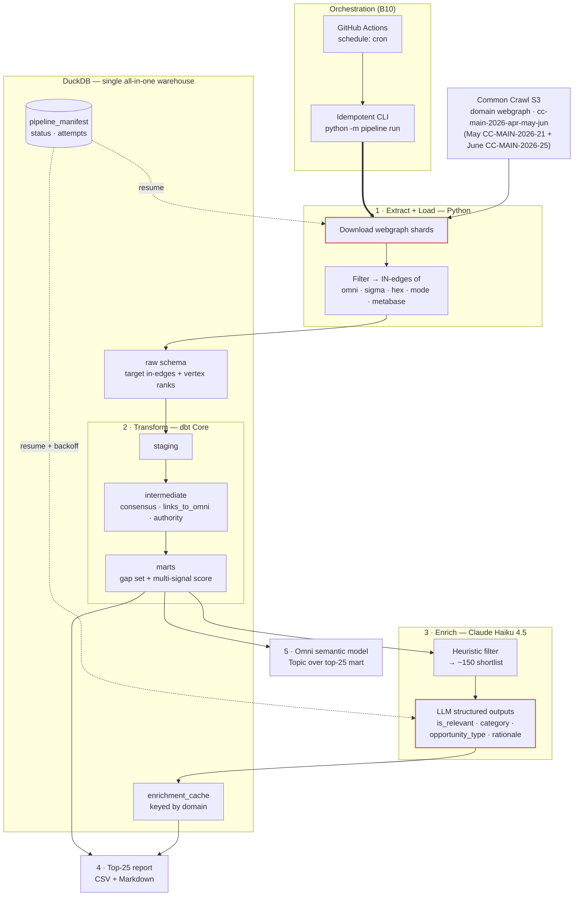

# Omni Growth Engineering Take-Home — Tech Spec

> **Status: COMPLETE.** Map: §2 design decisions & tradeoffs (locked, with rejected alternatives) · §6 recovery semantics · §7 implicit & explicit contracts · §8 Omni model · §9 week priorities · §10 out of scope · §11 deliverables. This document is Deliverable #5.

---

## 1. The question & framing

**Deliverable question:** _"Which high-value backlink opportunities should Omni investigate based on competitor backlink patterns?"_ → output **≤25 referring domains**, useful to a Growth Marketing team, **not merely a ranking of large numbers**.

**What this actually is:** a **backlink gap analysis** over Common Crawl's link graph — find referring _domains_ that link to Omni's competitors but **not** to Omni, rank by value, hand Growth a short actionable list.

**Clarifications resolved:**
- **Backlink** = inbound hyperlink; **referring domain** = unique linking domain (the deliverable unit; brief caps at 25).
- **"Backlink position"** = competitive standing (who links to us vs. competitors) → the gap is the opportunity.
- **"Semantic layer"** here = BI/analytics business-metric layer (Omni modeling) 
- **"Retry semantics"** = idempotency + resumability + checkpointing for a recurring scheduled pipeline. Mirror the team's "claim-a-row" pattern at MVP scale (our own lightweight manifest — NOT their Snowflake/AWS/Dagster).

---

## 2. Locked scope decisions (all batches)

| # | Area | **Decision** | Rationale (1-line) | Rejected |
|---|---|---|---|---|
| B1 | Language | **Python** | Native fit: DuckDB, dbt Core, CC tooling | TypeScript |
| B2 | Data source | **CC domain webgraph**, single release `cc-main-2026-apr-may-jun` | Pre-aggregated domain→domain edges + built-in ranks; laptop-feasible; already the right shape | Raw WAT parsing (heavy, sampling-biased); WAT hybrid (stretch) |
| B3 | Competitor set | Omni + Sigma + Hex + **Mode + Metabase** | All-modern/embedded-BI peer set → topically-relevant, cleaner referrers | Looker+Tableau (incumbents, noisier); mixed |
| B4 | "High-value" ranking | **Multi-signal score**: competitor-consensus × authority × gap, after filtering | Directly answers "useful, not just big numbers" | Consensus-only; authority-only (big-numbers trap) |
| B5 | Two-crawl handling ("both") | **Single `cc-main-2026-apr-may-jun` release**, which aggregates May (`CC-MAIN-2026-21`) + June (`CC-MAIN-2026-25`) as inputs. Cite both crawl IDs in write-up. | Both named collections are literal inputs to one graph → honors "use both" literally, keeps feasible path. Verified vs. CC release index. | Union of 2 snapshots; one-now-both-wired; per-month trend (all moot/week-1) |
| B6 | Ingest / scale | **Filter edges to target in-edges on ingest** (dst ∈ 5 targets) | Billions of edges → thousands; laptop-trivial, still complete for gap analysis | Full-load-then-filter |
| B7 | Authority signal | **CC's published domain ranks** (harmonic centrality + PageRank), joined in | Free, standard, defensible, zero extra compute | Compute own PageRank (meaningless on filtered subgraph); external Ahrefs/Moz (no API) |
| B8 | Filtering + enrichment | **Heuristics + bounded cached LLM (Haiku 4.5) hybrid** | Deterministic cleanup → ~150 shortlist, then Haiku pass for relevance-filter + category + opportunity-type + rationale. Best "Growth-useful"; mirrors team's LLM-enrichment→raw-outputs→dbt pattern | Heuristics-only (defensible lean MVP; now the week-1 fallback); Sonnet 5 (overkill); minimal |
| B9 | Retry-semantics depth *(B3)* | **Real minimal manifest + demonstrable resume**, scoped to the 2 flaky seams (S3 download, LLM calls); backoff only on LLM | Named grading criterion; ~30 lines in DuckDB; kill-and-resume actually works | Overwrite-only (no partial resume); full dead-letter/backoff/circuit-breaker (over-built; ≈ team's platform) |
| B10 | Scheduling / orchestration *(B3)* | **Idempotent CLI entrypoint** (`python -m pipeline run --release …`) **+ committed GH Actions `schedule:` cron / Makefile** | Schedule just re-calls the idempotent entrypoint; ties to B9; real, free, no infra | Real orchestrator (Dagster/Airflow — overkill; rebuilds team's stack); prose-only |
| B11 | dbt project structure *(B3)* | **Standard 3-layer + targeted tests + 1 contract on top-25 mart + singular "no gap domain links to omni" test.** ⚠️ Known depth-gap — revisit hands-on at build | Idiomatic; the singular test asserts the analysis _thesis_; hits brief's "contracts" ask | Minimal (underwhelms named deliverable); elaborate (padding) |
| B12 | Omni semantic model *(B3)* | **One faithful Omni Topic over the top-25 mart** — dimensions + measures + score metric; ground syntax in Omni docs at build | Fidelity to their real format = strongest signal (their product); one wide mart = degenerate star | Elaborate multi-model (more chances to get their format wrong); generic MetricFlow/LookML YAML (reads as "didn't learn Omni") |
| B13 | Report format *(B4)* | **CSV (data) + Markdown report** w/ per-domain `score · category · opportunity_type · why · suggested action` | Two audiences (pipeline vs human); hits "actionable, not big-numbers" bar | Notebook (reads as scratchpad); Omni dashboard mock (can't truly render) |
| B14 | Packaging *(B4)* | **Makefile + pinned lockfile; NO Docker** (documented as trivial optional add) | Pure Python+DuckDB → no system deps; `make setup && make run` is the expected UX; Docker ROI ≈ nil here | Docker primary (heavier, needs daemon + volume mounts for marginal gain); both |
| B15 | Warehouse target *(B4)* | **Local `.duckdb` default; MotherDuck = one-line documented swap** | Reproducible with zero accounts; prod / "Omni-connects-here" story as a `profiles.yml` switch | MotherDuck-first (needs account/token to grade); local-only (drops prod story) |
| B16 | Intermediate storage *(B4)* | **All-in-DuckDB** — raw loaded into a `raw` schema; downloaded CC files on disk = true landing zone. Parquet/S3 landing = described prod evolution | Simpler + more idiomatic dbt (transform tables already in warehouse); one artifact; fewer wiring snags while learning dbt | Parquet landing (marginal signal, extra `source` file-path wiring — not worth a few-hours build) |

**Model IDs:** enrichment = `claude-haiku-4-5`. Sonnet alt = `claude-sonnet-5`.
_(B9–B12 = Batch 3 engineering-rigor; B13–B16 = Batch 4 packaging.)_

---

## 3. Verified facts (from CC live sources)

- **May 2026 crawl** = `CC-MAIN-2026-21` (May 8–21, 2026)
- **June 2026 crawl** = `CC-MAIN-2026-25` (Jun 5–18, 2026)
- **Domain webgraph release** `cc-main-2026-apr-may-jun` built from **Apr + May + June 2026** crawls → **includes both named crawls**.
- Webgraph cadence: **rolling ~monthly**, each a 3-month window (corrects an earlier wrong "3×/year + lag" assumption — no lag; latest already includes June).
- **✅ VERIFIED (2026-07-22, HTTP HEAD):** all three files live under `https://data.commoncrawl.org/projects/hyperlinkgraph/cc-main-2026-apr-may-jun/domain/` — `…domain-vertices.txt.gz` **0.9 GB**, `…domain-edges.txt.gz` **14.6 GB**, `…domain-ranks.txt.gz` **2.4 GB** (~17.9 GB total gz; last-modified 2026-06-24). `Accept-Ranges: bytes` → chunked resumable downloads work, which is what the manifest download units key on.

---

## 4. Pipeline sketch (clean-room, recommended stack)

```
Extract: pull cc-main-2026-apr-may-jun domain webgraph (vertices=ranks, edges) from CC S3
  → filter edges to IN-edges of {omni, sigma, hex, mode, metabase} on ingest → load raw into DuckDB (raw schema)

Transform (dbt Core on DuckDB):
  staging      → clean/standardize vertices + target in-edges
  intermediate → resolve linking domains; join CC ranks; compute per-domain signals
                 (consensus = # of the 5 competitors it links to; links_to_omni bool; authority rank)
  marts        → gap set (links to >=1 competitor, NOT omni) + multi-signal score

Enrich (bounded, cached): deterministic heuristic filter -> ~150 shortlist
  → Haiku 4.5 (structured outputs) -> {is_relevant, category, opportunity_type, rationale}
  → cache to DuckDB table keyed by domain → exported to COMMITTED artifacts/enrichment_cache.csv
    (idempotent; keyless re-runs bootstrap from the committed cache — explicit DRY RUN without API key)

Publish: top-25 report (domain + score + category + opportunity_type + why) + Omni semantic model
```

**High-level architecture:**



_Numbered stages = runtime data flow. Red nodes = the two flaky external seams; dotted edges = `pipeline_manifest` resume/backoff (B9). Everything inside DuckDB is deterministic/idempotent._

---

## 5. Scoring methodology (multi-signal)

- **Gap** (hard filter): domain links to ≥1 of {sigma, hex, mode, metabase} **AND does not link to omni.co**.
- **Consensus**: count of those 4 competitors the domain links to (more = more clearly relevant/reachable).
- **Authority**: CC harmonic centrality / PageRank of the linking domain.
- **Relevance** (LLM): `is_relevant` filter + `category` → drop noise (aggregators/listicles/off-topic).
- **Rank** = weighted blend of consensus × authority, gated by relevance; final = top 25 + actionability tags.
- **Heuristic pre-filters** (free, deterministic): junk TLDs; mega-platforms (facebook/youtube/wikipedia/…); self + competitor domains; rank floor.

---

## 6. Recovery semantics

**Two flaky external seams** — everything between them is deterministic dbt SQL, idempotent by construction:
1. **Webgraph download** — 17.9 GB over HTTP, fetched in 64 MiB byte-range chunks.
2. **LLM enrichment calls** — ≤150 requests that can rate-limit or 5xx.

**One mechanism covers both — `pipeline_manifest`** (PK `(release, stage, unit)`; lifecycle `pending → in_progress → done / failed`; `attempts` counted):
- A unit **claims its row** before work and marks `done` after; re-runs skip `done`, so an interrupted run resumes at the first incomplete unit. `failed` and orphaned `in_progress` rows stay claimable.
- **Download unit = one chunk**, written at its byte offset into a preallocated sparse file (`Accept-Ranges` verified, §3). The disk guard gates on *remaining* undownloaded bytes computed from manifest records — a resume needs no download headroom.
- **Enrichment unit = one domain**; the cache table (PK domain, upserts) doubles as the checkpoint — a classified domain is never re-called. In-flight transport backoff is delegated to the SDK (`max_retries=5`); cross-run retry is the manifest's job.
- **Everything else needs no bookkeeping**: loads and dbt models are `CREATE OR REPLACE` over deterministic inputs; each stage opens/closes its own connection (DuckDB single-writer), and a dead process releases the lock.
- **Scheduling composes with recovery** (B10): the committed cron re-invokes the idempotent CLI — a failed scheduled run's recovery procedure *is* the next run.

**Proven, not asserted:** SIGTERM mid-download left 9/36 chunks `done` + 1 `in_progress`; a plain re-run completed the file, and the interrupted chunk permanently reads `attempts = 2` — the manifest doubles as the forensic record of every crash.

---

## 7. Contracts — implicit & explicit

Every stage boundary is either **explicit** (machine-enforced; violation fails the run) or **implicit** (assumed; monitored so drift fails loudly rather than silently).

**Explicit contracts (enforced):**

| Boundary | Contract | Enforced by |
|---|---|---|
| extract → warehouse | `raw.*` table shapes (targets / vertices / ranks / target_edges) | typed `read_csv(columns=…)` loads (fail on drift) + dbt source & staging tests (`unique` / `not_null`) |
| dbt marts → consumers | `top_backlink_opportunities`: 12 columns, exact names + types | dbt **model contract** (`enforced: true`) — build fails on drift |
| analysis semantics | no gap domain links to Omni (thesis) · score ∈ [0,1] · ≤ 25 rows · consensus ∈ {1..4} | singular tests + generic tests, run on every `dbt build` |
| enrich ↔ LLM | response shape `{is_relevant: bool, category: enum(9), opportunity_type: enum(7), rationale: str}` | **structured outputs `json_schema`** (API-side enforcement) + `temperature=0` + pinned `claude-haiku-4-5` |
| enrich → warehouse | `enrich.domain_enrichment` PK(domain) + provenance (`model`, `enriched_at`) | DDL at init; `INSERT OR REPLACE` upsert |
| recovery | unit lifecycle `pending → in_progress → done/failed`; `done` is never redone | `pipeline_manifest` PK(release, stage, unit) + claim/skip helpers (unit-tested) |
| scheduling | every CLI command idempotent + resumable; non-zero exit on failure | stage design + subprocess exit-code propagation |
| repo artifacts | `artifacts/enrichment_cache.csv` column order = cache DDL; sorted by domain (stable git diffs) | export query |
| human review | `enrichment_overrides` seed beats the LLM verdict (`coalesce(override, llm)`); rows only after manual verification; `reason` mandatory | dbt seed + `unique`/`not_null` tests; applied in the top mart |

**Implicit contracts (assumed + monitored):**

| Assumption | Why acceptable | How drift surfaces |
|---|---|---|
| CC file layout & formats (3 tab-separated gz files at the documented URL pattern; reversed-domain notation; edges reference vertices line-ids) | external publisher contract, stable across releases | HEAD-verified pre-build; typed load fails loudly; target-coverage check aborts if omni.co missing |
| ranks cover (nearly) all vertices | CC builds both from the same graph | LEFT JOIN + explicit NULL handling at the rank floor; staging tests |
| registered-domain grain (subdomains pre-aggregated) | the webgraph's documented unit; matches the "referring domain" deliverable | n/a — definitional |
| domain name + world knowledge suffice for classification (no page fetch) | MVP scope; errors bounded by the is_relevant gate + human review of 25 rows | spot-check; future: homepage grounding |
| DuckDB single-writer | stages open/close their own connection | loud lock error at connect |
| Anthropic API reachable / priced as expected | bounded ≤150 calls, ~$0.10–0.50, cached thereafter | SDK backoff-retries; explicit DRY RUN degradation without key |

---

## 8. Omni semantic model (B12)

**What ships:** a hand-authored model in Omni's model-IDE file layout, over the contracted `marts.top_backlink_opportunities` table:

```
omni/
├── views/top_backlink_opportunities.view   14 dimensions · 5 measures
├── topics/backlink_opportunities.topic     curated query entry point
└── README.md                               equivalent-SQL audit + connect path
```

**Design.** One topic over one wide view, deliberately: a 25-row mart is a degenerate star, and more files would add surface area for format errors, not value. dbt owns all transforms — Omni's dbt integration is a one-way import, so the semantic layer is authored in Omni's format, not dbt's — and in Omni's three-layer terms these files are the governed *shared-model* curation over the schema model Omni would auto-generate from `marts`. The view exposes every mart column with labels and groups, adds two derived dimensions (`tld`, `authority_bucket`), five measures including a filtered measure (`integrations_page_count`), and `ai_context` on both files phrased for the questions Growth would ask the Omni Agent.

**Fidelity.** Every parameter used — `primary_key`, `group_label`, `sql` with `${field}` references, `format`, `aggregate_type`, filtered-measure `filters`, `base_view`, `default_row_limit`, `ai_context` — was verified against Omni's parameter references (docs.omni.co) before writing; no syntax from memory.

**Validation (no live instance required).** (1) The numbers are proven upstream — the mart is dbt-built, tested, and contract-enforced; the semantic layer only adds meaning. (2) Every measure and derived dimension carries an equivalent-SQL translation, executed live against the warehouse (`omni/README.md`). (3) The connect path is real: point Omni at the MotherDuck target (`dbt/profiles.yml`, one line) and it generates its schema model from the same marts — a live import was deliberately deferred (§9 priority 3).

---

## 9. If I had a week — priorities

1. **Scoring and LLM experimentation — prompt & sampling.** Treat the classifier as a tunable component: systematic prompt variants and sampling settings run against the full shortlist, measured with the harness this repo already ships — committed cache versions, diffable verdict flips, and the pre-committed regression gate. Goal: quantified verdict stability (flip rate per prompt change) and closing the residual misreads (`coda.io`, `atlassian.com`) by measurement rather than case-patching. Work with downstream customers to try out different combinations of scoring algorithms and LLM model / prompt that work best.
2. **Wire the prototype to the cloud.** Provision a real AWS sandbox with actual resources: the pipeline image in **ECR**, runs invoked via **Lambda** on the schedule, **artifacts persisted to S3** instead of local-only, and **MotherDuck** as the shared warehouse (already a one-line dbt target swap). Same code and retry semantics — the manifest design carries over unchanged; only the storage/compute bindings move.
3. **Close the loop with the actual consumer.** Propagate results into a real **Omni dashboard** (MotherDuck-backed import of the model), then put it in front of a downstream customer: does the mock Omni model match what they would actually expect to explore, and which "report" format genuinely helps their work most — the static report, the dashboard, or something else? Let their answers reshape the deliverable.

---

## 10. Out of scope (MVP)

- **Monitoring** — no metrics, alerting, or run-health dashboards; failures surface as exit codes + manifest state.
- **Evals** — no automated evaluation harness for the LLM classifier beyond the regression gate and human spot-checks.
- **Gold sets** — no labeled ground-truth set for measuring classifier accuracy; correctness rests on schema-enforced outputs, human review of the 25 rows, and the overrides seed.
- **Full production infra swap** — Snowflake + Dagster, mirroring the team's existing workflow architecture, deliberately not built: this is a clean-room MVP on the recommended stack.

---

## 11. Delivery statement — the deliverables

1. **ETL framework + code** — `pipeline/`: chunked resumable extract (manifest-checkpointed 64 MiB ranges over 17.9 GB), filtered load (2B edges → 4,925), bounded cached LLM enrichment, deterministic report stage; idempotent CLI throughout.
2. **dbt project** — `dbt/`: 3 layers, 9 models, 37 tests (incl. the no-gap-domain-links-to-Omni thesis test), enforced 12-column contract on the deliverable mart, 3 seeds (structural exclusions + human overrides).
3. **Omni semantic model** — `omni/`: view + topic in Omni's model-IDE layout, every parameter verified against Omni's docs, live equivalent-SQL audit.
4. **Top-25 report** — `artifacts/REPORT.md` + `top_25_report.csv`: footprint headline (Omni 265 referrers ≈ 1/7 of Metabase), auditable 7-step funnel, per-domain rationale + playbook action, deliberate-exclusions table.
5. **Tech Spec** — this document: contracts (§7), decisions + rejected alternatives (§2), tradeoffs (throughout), recovery semantics (§6).
6. **Git repo** — full history including the LLM iteration story (prompt v1 → v2 → v2.1, pre-committed regression gate, human-overrides layer — every classification change diffable).
