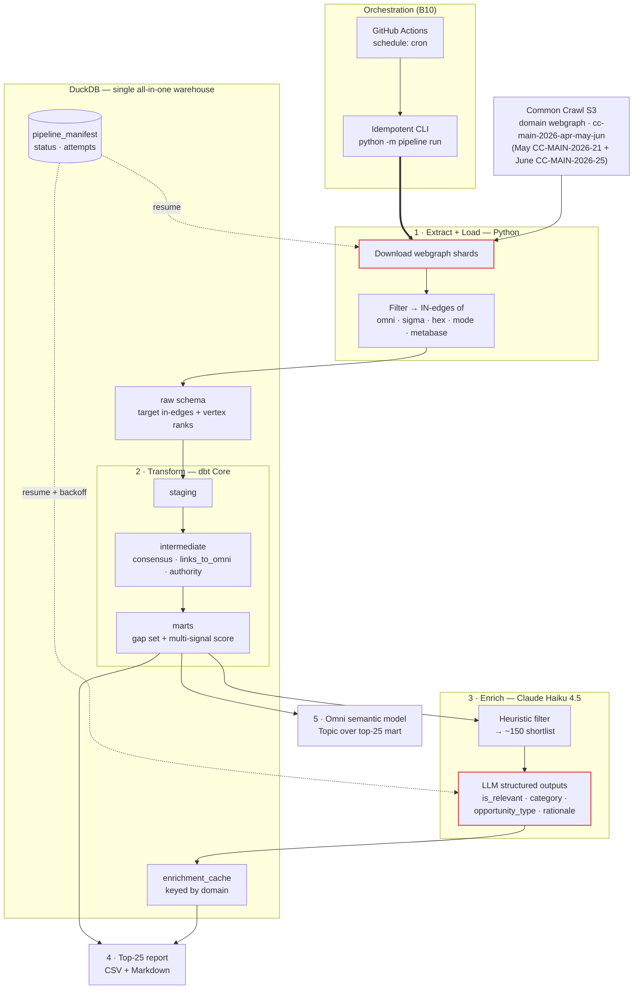

# Omni Growth Engineering Take-Home — Tech Spec (DRAFT, in progress)

> **Status:** **Scope fully locked (Batches 1–4).** Ready to build — see §8 for the build plan + flagged deep-dives. This doc doubles as the start of Deliverable #5 (Tech Spec).

---

## 1. The question & framing

**Deliverable question:** _"Which high-value backlink opportunities should Omni investigate based on competitor backlink patterns?"_ → output **≤25 referring domains**, useful to a Growth Marketing team, **not merely a ranking of large numbers**.

**What this actually is:** a **backlink gap analysis** over Common Crawl's link graph — find referring _domains_ that link to Omni's competitors but **not** to Omni, rank by value, hand Growth a short actionable list.

**Clarifications resolved:**
- **Backlink** = inbound hyperlink; **referring domain** = unique linking domain (the deliverable unit; brief caps at 25).
- **"Backlink position"** = competitive standing (who links to us vs. competitors) → the gap is the opportunity.
- **"Semantic layer"** here = BI/analytics business-metric layer (Omni modeling) — **NOT** RAG / embeddings / vector search. No vector DB, no embeddings. Pure structured SQL analytics.
- **"Retry semantics"** = idempotency + resumability + checkpointing for a recurring scheduled pipeline. Mirror the team's "claim-a-row" pattern at MVP scale (our own lightweight manifest — NOT their Snowflake/AWS/Dagster).
- **The architecture diagram = context about the team we're interviewing with, NOT a system we build on.** This is a **clean-room build** on the recommended stack (Python / DuckDB / dbt Core / Omni model).

---

## 2. Locked scope decisions (all batches)

| # | Area | **Decision** | Rationale (1-line) | Rejected |
|---|---|---|---|---|
| B1 | Language | **Python** | Native fit: DuckDB, dbt Core, Parquet, CC tooling | TypeScript |
| B2 | Data source | **CC domain webgraph**, single release `cc-main-2026-apr-may-jun` | Pre-aggregated domain→domain edges + built-in ranks; laptop-feasible; already the right shape | Raw WAT parsing (heavy, sampling-biased); WAT hybrid (stretch) |
| B3 | Competitor set | Omni + Sigma + Hex + **Mode + Metabase** | All-modern/embedded-BI peer set → topically-relevant, cleaner referrers | Looker+Tableau (incumbents, noisier); mixed |
| B4 | "High-value" ranking | **Multi-signal score**: competitor-consensus × authority × gap, after filtering | Directly answers "useful, not just big numbers" | Consensus-only; authority-only (big-numbers trap) |
| B5 | Two-crawl handling ("both") | **Single `cc-main-2026-apr-may-jun` release**, which aggregates May (`CC-MAIN-2026-21`) + June (`CC-MAIN-2026-25`) as inputs. Cite both crawl IDs in write-up. | Both named collections are literal inputs to one graph → honors "use both" literally, keeps feasible path. Verified vs. CC release index. | Union of 2 snapshots; one-now-both-wired; per-month trend (all moot/week-1) |
| B6 | Ingest / scale | **Filter edges to target in-edges on ingest** (dst ∈ 5 targets) | Billions of edges → thousands; laptop-trivial, still complete for gap analysis | Full-load-then-filter |
| B7 | Authority signal | **CC's published domain ranks** (harmonic centrality + PageRank), joined in | Free, standard, defensible, zero extra compute | Compute own PageRank (meaningless on filtered subgraph); external Ahrefs/Moz (no API) |
| B8 | Filtering + enrichment | **Heuristics + bounded cached LLM (Haiku 4.5) hybrid** | Deterministic cleanup → ~150 shortlist, then Haiku pass for relevance-filter + category + opportunity-type + rationale. Best "Growth-useful"; mirrors team's LLM-enrichment→raw-outputs→dbt pattern | Heuristics-only (defensible lean MVP; now the week-1 fallback); Sonnet 5 (overkill); minimal |
| B9 | Retry-semantics depth *(B3)* | **Real minimal manifest + demonstrable resume**, scoped to the 2 flaky seams (S3 download, LLM calls); backoff only on LLM | Named grading criterion; ~30 lines in DuckDB; kill-and-resume actually works | Overwrite-only (no partial resume); full dead-letter/backoff/circuit-breaker (over-built; ≈ team's platform) |
| B10 | Scheduling / orchestration *(B3)* | **Idempotent CLI entrypoint** (`python -m pipeline run --release …`) **+ committed GH Actions `schedule:` cron / Makefile** | Schedule just re-calls the idempotent entrypoint; ties to B9; real, free, no infra | Real orchestrator (Dagster/Airflow — overkill; rebuilds team's stack); prose-only |
| B11 | dbt project structure *(B3)* | **Standard 3-layer + targeted tests + 1 contract on top-25 mart + singular "no gap domain links to omni" test.** ⚠️ Known depth-gap — revisit hands-on at build | Idiomatic; the singular test asserts the analysis _thesis_; hits brief's "contracts" ask | Minimal (underwhelms named deliverable); elaborate (padding) |
| B12 | Omni semantic model *(B3)* | **One faithful Omni Topic over the top-25 mart** — dimensions + measures + score metric; ground syntax in Omni docs at build | Fidelity to their real format = strongest signal (their product); one wide mart = degenerate star | Elaborate multi-model (more chances to get their format wrong); generic MetricFlow/LookML YAML (reads as "didn't learn Omni") |
| B13 | Report format *(B4)* | **CSV (data) + Markdown report** w/ per-domain `score · category · opportunity_type · why · suggested action` | Two audiences (pipeline vs human); hits "actionable, not big-numbers" bar | Notebook (reads as scratchpad); Omni dashboard mock (can't truly render) |
| B14 | Packaging *(B4)* | **Makefile + pinned lockfile; NO Docker** (documented as trivial optional add) | Pure Python+DuckDB → no system deps; `make setup && make run` is the expected UX; Docker ROI ≈ nil here | Docker primary (heavier, needs daemon + volume mounts for marginal gain); both |
| B15 | Warehouse target *(B4)* | **Local `.duckdb` default; MotherDuck = one-line documented swap** | Reproducible with zero accounts; prod / "Omni-connects-here" story as a `profiles.yml` switch | MotherDuck-first (needs account/token to grade); local-only (drops prod story) |
| B16 | Intermediate storage *(B4)* | **All-in-DuckDB** — raw loaded into a `raw` schema; downloaded CC files on disk = true landing zone. Parquet/S3 landing = described prod evolution | Simpler + more idiomatic dbt (transform tables already in warehouse); one artifact; fewer wiring snags while learning dbt | Parquet landing (marginal signal, extra `source` file-path wiring — not worth a few-hours build) |

**Model IDs:** enrichment = `claude-haiku-4-5`. Sonnet alt = `claude-sonnet-5`.
_(B9–B12 = Batch 3 engineering-rigor; B13–B16 = Batch 4 packaging.)_

---

## 3. Verified facts (from CC live sources)

- **May 2026 crawl** = `CC-MAIN-2026-21` (May 8–21, 2026)
- **June 2026 crawl** = `CC-MAIN-2026-25` (Jun 5–18, 2026)
- **Domain webgraph release** `cc-main-2026-apr-may-jun` built from **Apr + May + June 2026** crawls → **includes both named crawls**.
- Webgraph cadence: **rolling ~monthly**, each a 3-month window (corrects an earlier wrong "3×/year + lag" assumption — no lag; latest already includes June).
- **✅ VERIFIED (2026-07-22, HTTP HEAD):** all three files live under `https://data.commoncrawl.org/projects/hyperlinkgraph/cc-main-2026-apr-may-jun/domain/` — `…domain-vertices.txt.gz` **0.9 GB**, `…domain-edges.txt.gz` **14.6 GB**, `…domain-ranks.txt.gz` **2.4 GB** (~17.9 GB total gz; last-modified 2026-06-24). `Accept-Ranges: bytes` → chunked resumable downloads work, which is what the manifest download units key on.

---

## 4. Pipeline sketch (clean-room, recommended stack)

```
Extract: pull cc-main-2026-apr-may-jun domain webgraph (vertices=ranks, edges) from CC S3
  → filter edges to IN-edges of {omni, sigma, hex, mode, metabase} on ingest → load raw into DuckDB (raw schema)

Transform (dbt Core on DuckDB):
  staging      → clean/standardize vertices + target in-edges
  intermediate → resolve linking domains; join CC ranks; compute per-domain signals
                 (consensus = # of the 5 competitors it links to; links_to_omni bool; authority rank)
  marts        → gap set (links to >=1 competitor, NOT omni) + multi-signal score

Enrich (bounded, cached): deterministic heuristic filter -> ~150 shortlist
  → Haiku 4.5 (structured outputs) -> {is_relevant, category, opportunity_type, rationale}
  → cache to DuckDB table keyed by domain (idempotent; re-runs read cache)

Publish: top-25 report (domain + score + category + opportunity_type + why) + Omni semantic model
```

**High-level architecture:**



_Numbered stages = runtime data flow. Red nodes = the two flaky external seams; dotted edges = `pipeline_manifest` resume/backoff (B9). Everything inside DuckDB is deterministic/idempotent._

---

## 5. Scoring methodology (multi-signal)

- **Gap** (hard filter): domain links to ≥1 of {sigma, hex, mode, metabase} **AND does not link to omni.co**.
- **Consensus**: count of those 4 competitors the domain links to (more = more clearly relevant/reachable).
- **Authority**: CC harmonic centrality / PageRank of the linking domain.
- **Relevance** (LLM): `is_relevant` filter + `category` → drop noise (aggregators/listicles/off-topic).
- **Rank** = weighted blend of consensus × authority, gated by relevance; final = top 25 + actionability tags.
- **Heuristic pre-filters** (free, deterministic): junk TLDs; mega-platforms (facebook/youtube/wikipedia/…); self + competitor domains; rank floor.

---

## 6. Reproducibility, retry & scheduling (LOCKED — B9/B10)

**Two flaky external seams** (everything between is deterministic dbt SQL, idempotent by construction):
1. **S3 webgraph download** — large, possibly sharded files that can fail partway.
2. **~150 LLM enrichment calls** — transient 5xx / rate limits.

**Retry / recovery design (B9 — real minimal manifest + demonstrable resume):**
- `pipeline_manifest` table in DuckDB keyed by `(release, stage, unit)` → `status / attempts / updated_at`. Extract **claims-a-row** per shard before working, marks `done` after; re-runs skip `done` units.
- LLM enrichment **cache-by-domain** table doubles as its checkpoint (a domain already classified is never re-called).
- **Backoff-with-retry only on the LLM calls** (the one seam that genuinely rate-limits); extract simply retries the failed shard.
- Kill the run mid-flight → re-invoke → it resumes. This is the demonstrable "recovery semantics" the brief grades.

**Scheduling (B10 — idempotent entrypoint + committed cron stub):**
- Single entrypoint `python -m pipeline run --release cc-main-2026-apr-may-jun`, safe to re-run.
- Committed **GitHub Actions `schedule:` cron** (or Makefile target) re-invokes it on cadence. A failed run is just re-run; the manifest skips completed work. No orchestrator, no infra.
- Target = local `.duckdb` (dev) or **MotherDuck** (shared/scheduled prod).

**LLM reproducibility:** structured outputs (`json_schema`) for shape; `temperature=0` (works on Haiku 4.5 — NOTE: Sonnet 5 rejects non-default sampling → would rely on caching only); cache-to-table so re-runs don't re-call; Batch API (50% off) optional since scheduled/non-latency-sensitive.

**Cost:** ~$0.10–0.50/run Haiku (vs ~$0.35–1.50 Sonnet) at ~150–300 shortlist calls; effectively one-time due to caching. Non-issue.

---

## 7. Omni semantic model (design notes — LOCKED B12)

**What Omni's model is (verified from docs):** a semantic layer over the warehouse, in **three layers** — _schema model_ (auto-generated from the warehouse, inferred joins/keys) → _shared model_ (governed, org-wide metric definitions) → _workbook model_ (ad-hoc, extends shared). Signature feature: metrics built while exploring a workbook can be **promoted** up into the shared model (and down into the DB schema) — live/bidirectional, unlike static LookML. Building blocks: **Topics** (curate joined **views** into a query starting point), **views**, **fields** split into **dimensions** + **measures**, auto-inferred **joins**.

**dbt relationship:** the dbt integration is a **one-way import** (Omni ingests dbt semantic models/metrics; it does _not_ push Omni metrics back to dbt). → Our story: **dbt owns the transforms/marts; Omni models directly on top.** We do _not_ author metrics in dbt's semantic layer.

**Our build (B12):** hand-write **one faithful Omni Topic** over the top-25 mart (can't connect Omni to a laptop DuckDB). Shape = **degenerate star / one wide mart** (one row per referring domain): dimensions `domain, category, opportunity_type, tld, authority_bucket`; measures `referring_domain_count, avg_authority, consensus`; opportunity **score** as a metric; a filter reproducing the top-25. Clean, well-named mart columns ⇒ better Omni model (Omni auto-generates from schema — reinforces B11 mart discipline).

**Validation approach (LOCKED = A):** No live Omni instance by default (hosted Omni can't reach a local DuckDB file). Validity rests on: (1) the dbt marts the model sits on are runnable + **tested** (objective data validation); (2) model-as-code grounded in Omni's real syntax — the reviewers are Omni; (3) each measure/dimension carries its **equivalent SQL** for line-by-line audit against the marts; (4) optional CI lint if Omni ships a validator. **Stretch (B — time-permitting):** connect a free Omni instance to **MotherDuck** (B15), import the model, and screenshot it loading + returning the top-25.

**Build-time:** pull Omni's exact modeling YAML syntax from docs — do **not** hand-write from memory. Refs: `docs.omni.co/modeling`, `/modeling/develop/model-generation`, `/integrations/dbt/semantic-layer`.

---

## 8. NEXT STEPS — BUILD (scope fully locked)

Scoping complete (B1–B16). Proposed build order:

1. ✅ **Scaffold** — DONE: `pipeline/` package (config · db + manifest · CLI), `pyproject` + `uv.lock` (Python pinned 3.12 for dbt compat), Makefile, `.env.example`, manifest tests green. Found: DuckDB rejects bare `current_timestamp` inside `ON CONFLICT DO UPDATE SET` → use `now()`.
2. ✅ **Extract + Load** — DONE 2026-07-22: 17.9 GB in 64 MiB manifest-tracked chunks; loads: vertices **121,091,933** · ranks **121,091,933** · target_edges **4,925** (≈2B-edge streaming scan, 141 s) · target coverage all 6 domains OK.
3. ✅ **dbt** — DONE: **40/40 nodes green** (incl. thesis test). Observed: referrers metabase 1,809 / mode 1,242 / hex 838 / sigma 738 / **omni 265** (≈1/7th of Metabase — the headline stat); funnel 4,023 unique referrers → 3,758 raw gap → **3,008** after filters; consensus histogram 31×4 / 73×3 / 243×2 / 2,664×1; pre-enrichment top-25 = modern-data-stack ecosystem (YC, Fivetran, Airbyte, Atlan, Monte Carlo…) + visible aggregator junk → validates the LLM relevance gate (31 consensus-4 domains > 25 slots). Seed tweak: PaaS wildcard hosts (herokuapp/netlify.app/vercel.app/web.app/pages.dev) excluded — principle: seeds = structural exclusions, LLM = content judgment.
4. **Enrich** — heuristic shortlist → Haiku 4.5 structured-outputs → cache-by-domain table (B8).
5. **Publish** — top-25 CSV + Markdown report w/ per-domain rationale + action (B13).
6. **Omni model** — one faithful Topic over the top-25 mart; pull exact YAML syntax from Omni docs (B12).
7. **Wrap** — GH Actions cron stub (B10), README, finalize this Tech Spec.

**Build-time deep-dives flagged:**
- **dbt structure (B11)** — user has limited dbt exposure; hands-on pass on models/tests/contracts, teach-as-we-go.
- **Omni model (B12)** — pull Omni's exact modeling YAML from docs at build; don't hand-write from memory.
- ✅ **CC webgraph path** — verified via HEAD 2026-07-22 (see §3): all three files live, ~17.9 GB total gz, byte-ranges supported.
- **Stretch (time-permitting):** live Omni import via MotherDuck for screenshot proof (validation B).

---

## 9. "If I had a week" backlog (already identified)

- WAT-based per-month (May vs June) delta/trend — domain webgraph can't separate months.
- Page-level anchor-text extraction (WAT) for richer relevance/context.
- External authority (Ahrefs/Moz DR) enrichment.
- Enforcement layer: dbt model contracts + Soda checks + Omni CI validator (mirrors team's _planned_ controls).
- Richer LLM grounding (fetch homepage title/meta for shortlist before classifying).

---

## 10. Out of scope (MVP)

- Monitoring / Observability
- Full crawl / WAT at scale.
- Live orchestration platform (stub/document only).
- Multi-run trend analysis.
- **Report evolution (B13 long-term):** live Omni dashboard instead of a static file; scheduled Slack/email digest with a "new opportunities since last run" delta; 
- **Prod infra swaps (documented, not built):** Docker/hermetic image (B14); Parquet-on-S3 landing zone (B16); Move onto AWS

---

**Deliverables mapping (assignment):** ETL framework + code · dbt project · Omni semantic model · top-25 report · this Tech Spec.
